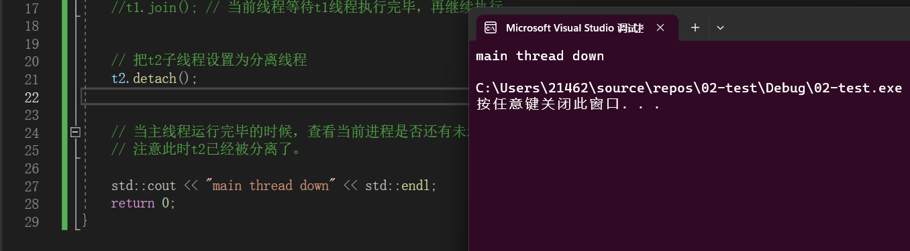
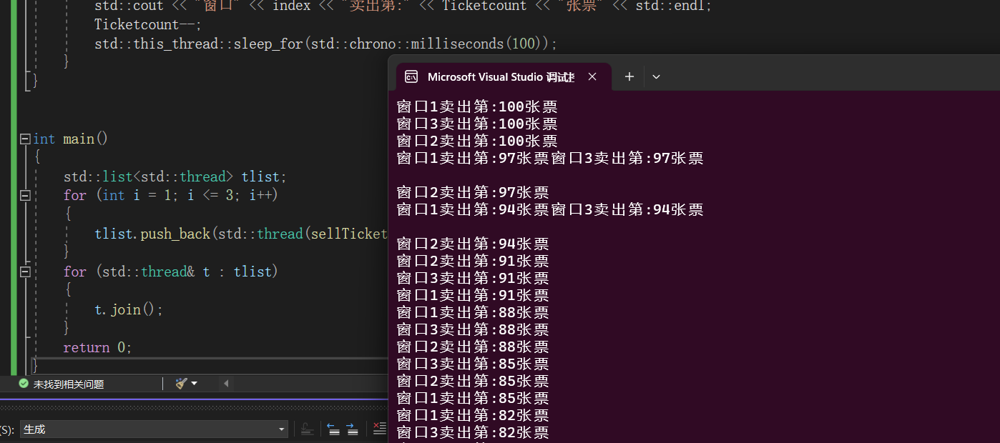
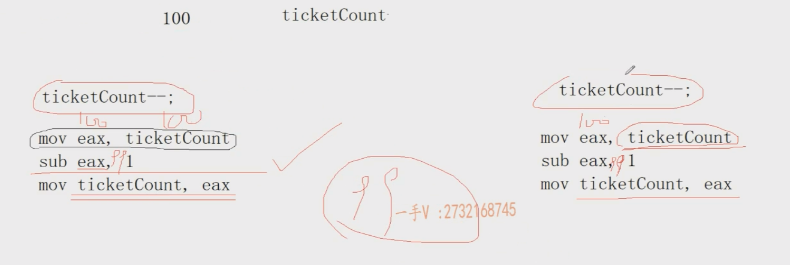
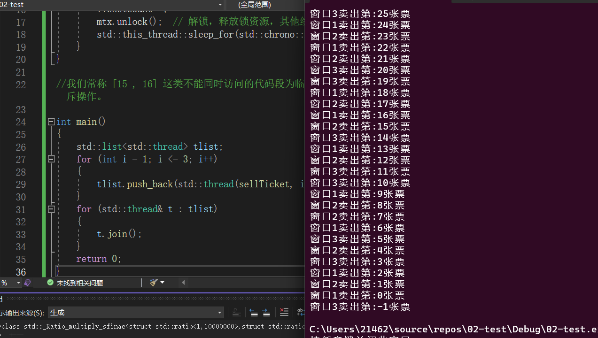
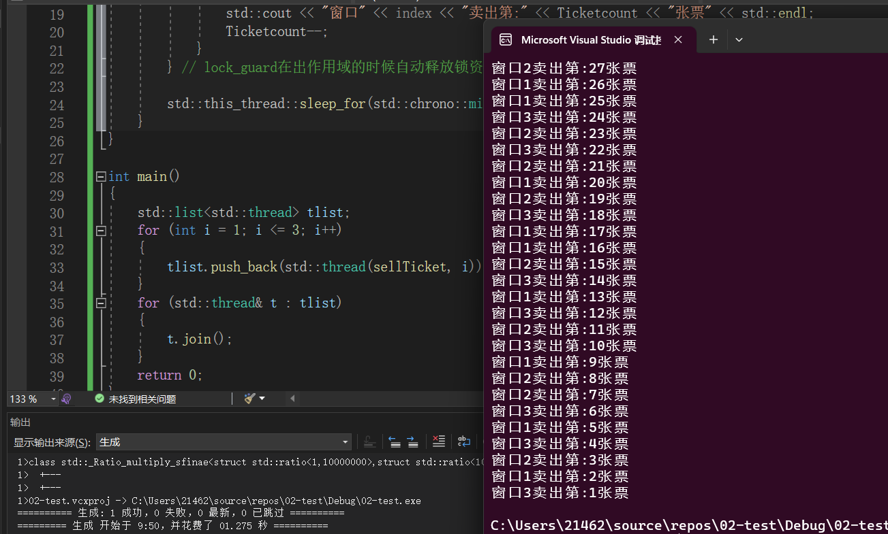
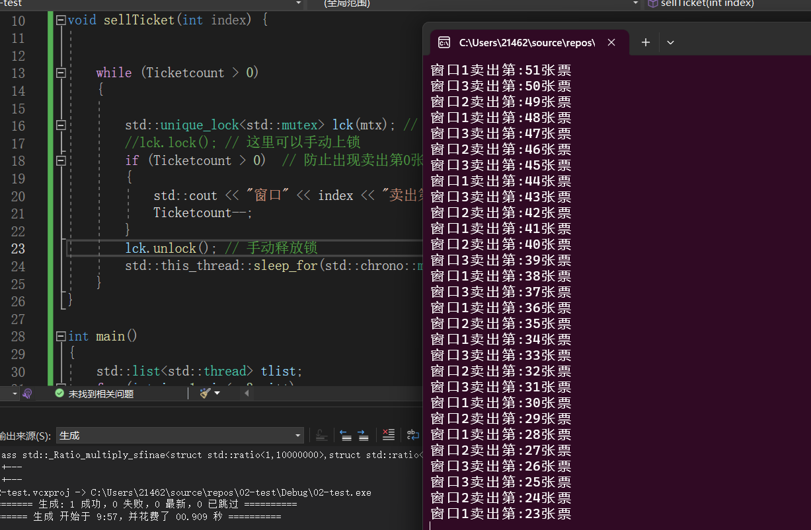

### `C++`语言级别的多线程编程

`C++`语言标准库提供了一个`<thread>`头文件，其能识别`C++`多线程程序所运行于的操作系统，如果是在`windows`平台下，其底层就调用`windows`平台下提供的多线程`API`:`createThread` ; 如果是在`linux`平台下，其调用`linux`平台提供的多线程`API`:`pthread_create` 

==本质上还是调用当前平台的所提供的线程的`API`== 

#### 基本使用操作

一个线程对应一个线程栈，在开辟线程的时候需要传入每个线程一个类似于`main`函数的起始函数，一个函数可以作为多个线程的起始函数。

`detach()` 是 `std::thread` 类的一个成员函数。当一个线程对象调用了 `detach()` 之后，该线程会变成“分离”状态（detached）。这意味着，当该线程的执行结束时，其资源会被自动回收，开发者不再需要对其进行任何处理。

```C++
#include <thread>
#include <iostream>

// 子线程函数结束，子线程结束
void threadHandle1()
{
    // 调用std命名空间中的this_thread空间中的::sleep_for()函数，std::chrono::seconds(2)表示2秒钟

    std::this_thread::sleep_for(std::chrono::seconds(2));
    std::cout << "hello world" << std::endl;
}
int main()
{
    // 创建一个线程对象，传入起始函数和函数参数，新线程就自动开启。
    //std::thread  t1(threadHandle1);
    std::thread t2(threadHandle1);

    // 子线程在执行的时候，主线程必须不能结束，也就是说，主线程必须等待子线程执行完毕。
    //t1.join(); // 当前线程等待t1线程执行完毕，再继续执行 


    // 把t2子线程设置为分离线程，主线程结束，整个进程结束。它用于将一个线程对象从其关联的线程分离，允许线程在后台运行而不需要等待其完成。
    t2.detach();


    // 当主线程运行完毕的时候，查看当前进程是否还有未运行完成的子线程，如果存在则进程就会异常终止。
    // 注意此时t2已经被分离了。

    std::cout << "main thread down" << std::endl;
    return 0;
}
```



> 注意，`t2`分离之后，主线程执行结束之后，`t2`的执行就是存在于后台之中,其执行结果不会再出现在屏幕之上。

#### 使用多线程模拟车站卖票的场景

场景：车站有100张车票，有三个窗口一起卖票，一张票只能被一个窗口所售卖，请写出对应的多线程程序。


##### 竞态条件：

> 竞态条件（Race Condition）是多线程或多进程编程中的一种常见问题，它发生在两个或多个线程（或进程）同时访问共享资源，并且至少有一个线程试图修改该资源的情况下。==竞态条件会导致不确定的行为，因为线程的执行顺序不确定，可能会产生不一致的结果。==
>
> 竞态条件的**主要原因是并发编程中的共享资源访问不受同步机制的保护**，因此多个线程可以同时读取和写入这些资源，导致不可预测的结果。共享资源可以是内存中的变量、文件、网络连接或任何多个线程可以访问的数据结构。
>
> 以下是一些常见的竞态条件示例和解决方法：
>
> 1.  **数据竞态**：多个线程同时访问和修改共享变量。例如，两个线程同时尝试递增一个整数变量。解决方法包括使用互斥锁（`Mutex`）来保护共享变量，确保只有一个线程可以访问它。
>   
> 2.  **死锁**：多个线程相互等待对方释放资源，导致所有线程无法继续执行。解决方法包括仔细设计锁的获取顺序，以避免循环等待，并使用超时机制来解除死锁。
>   
> 3.  **活锁**：线程在解决冲突时反复尝试，但最终未能取得进展，导致资源浪费。解决方法包括引入随机性或退避策略，以便线程不会无休止地竞争资源。
>   
> 4.  **条件竞态**：多个线程根据某些条件来执行操作，但条件可能在执行操作之前发生变化，导致不一致。解决方法包括使用条件变量（`Condition Variable`）来等待条件的满足。
>   
> 5.  **非阻塞算法的竞态条件**：在非阻塞算法中，多个线程试图在不使用互斥锁的情况下更新共享数据结构，可能导致数据结构处于不一致的状态。解决方法需要使用原子操作或其他非阻塞算法来确保一致性。
>
> 为了避免竞态条件，开发者通常需要使用同步机制，如互斥锁、信号量、条件变量等，以确保在共享资源上的操作是原子的，或者通过设计避免竞争条件的算法。同时，编写多线程代码时，必须非常小心地考虑线程之间的交互，以防止潜在的竞态条件问题。

`version1`：不存在锁的版本。

````C++
#include <thread>
#include <iostream>
#include <list>
int Ticketcount = 100 ; 


void sellTicket(int index ){

	while(Ticketcount > 0 )
	{
		std::cout << "窗口" << index << "卖出第:" << Ticketcount << "张票" << std::endl ; 
		Ticketcount -- ;
		std::this_thread::sleep_for(std::chrono::milliseconds(100) ) ;  
	}
}


int main()
{
	std::list<std::thread> tlist ; 
	for(int i = 1 ; i <=3 ; i ++ )
	{
		tlist.push_back(std::thread(sellTicket , i )) ; 
	}
	for(std::thread &t : tlist )
	{
		t.join() ; 
	}
	return 0 ;
}
````



> 造成上述结果的原因: `Ticketcount--`操作不是==线程安全==的操作，随着线程执行的顺序不同，结果也不同。
>
> `Ticketcount--` 所产生的汇编指令：
>
> ```
> mov  eax Ticketcount  // 从内存中读取数据到寄存器
> sub  eax  1       // eax中的值减去1
> mov  Ticketcount eax  // 将寄存器中的值读回到Ticketcount 内存中去
> ```
>
> **如果存在两个线程都进行了这个操作，并且第一个线程在执行到上述的第二条指令之后下时间片，执行第二个线程，第二个线程执行完上述第2条指令之后，跳转回第一个线程，之后第一个线程执行完毕，第二个线程执行完毕；如果`Tickcount`的初始值为10，则最终答案为9，并不是8**
>
> 

`version2`:使用互斥锁

```C++
#include <thread>
#include <iostream>
#include <list>
#include <mutex>
int Ticketcount = 100 ; 

std::mutex mtx ; // 声明一个全局的互斥锁

void sellTicket(int index ){
	
   
	while(Ticketcount > 0 )
	{
      mtx.lock() ;  // 上锁，如果其他线程没有获取到锁，则在这里被阻塞。
		std::cout << "窗口" << index << "卖出第:" << Ticketcount << "张票" << std::endl ; 
		Ticketcount -- ;
      mtx.unlock() ;  // 解锁，释放锁资源，其他线程此时可以获取锁。
		std::this_thread::sleep_for(std::chrono::milliseconds(100) ) ;  
	}
}

//我们常称 [15 , 16] 这类不能同时访问的代码段为临界区或临界代码段, 对于临界区代码段，应该保证其原子操作，故需要进行线程间的互斥操作。

int main()
{
	std::list<std::thread> tlist ; 
	for(int i = 1 ; i <=3 ; i ++ )
	{
		tlist.push_back(std::thread(sellTicket , i )) ; 
	}
	for(std::thread &t : tlist )
	{
		t.join() ; 
	}
	return 0 ;
}
```

> 存在的问题：
>
> ==竟然能够卖出第`-1`张票，==，假如线程1获取到了锁资源，并且其卖的还是最后一张票，在执行到第15行代码之后，线程3上时间片，==因为此时`Ticketcount`> 0故进入`while`循环==，但没获得锁资源，被阻塞，当线程1执行完毕，锁释放，线程3获得锁资源，**但此时`Ticketcount`已经为0了，就会输出卖出第0张票！卖出第-1张票同理**

`version3`:加上判断排除卖出第0张票的问题

```C++
#include <thread>
#include <iostream>
#include <list>
#include <mutex>
int Ticketcount = 100 ; 

std::mutex mtx ; // 声明一个全局的互斥锁

void sellTicket(int index ){
	
   
	while(Ticketcount > 0 )
	{
      mtx.lock() ;  // 上锁，如果其他线程没有获取到锁，则在这里被阻塞。
		if(Ticketcount > 0 )  // 防止出现卖出第0张票的情况
      {
         std::cout << "窗口" << index << "卖出第:" << Ticketcount << "张票" << std::endl ; 
			Ticketcount -- ;
      }
      mtx.unlock() ;  // 解锁，释放锁资源，其他线程此时可以获取锁。
		std::this_thread::sleep_for(std::chrono::milliseconds(100) ) ;  
	}
}

int main()
{
	std::list<std::thread> tlist ; 
	for(int i = 1 ; i <=3 ; i ++ )
	{
		tlist.push_back(std::thread(sellTicket , i )) ; 
	}
	for(std::thread &t : tlist )
	{
		t.join() ; 
	}
	return 0 ;
}
```

`version4`：使用智能锁,代替普通锁

普通锁所存在的潜在的安全隐患：如果上锁之后，在释放锁之前，程序`return`掉了或着抛出异常，锁资源无法被释放，这样容易造成**死锁**。

##### 智能锁介绍：

> `lock_guard` 和 `unique_lock` 都是 C++ 中用于管理互斥锁（`mutex`）的工具，它们提供了一种方便的方式来确保在多线程环境中对共享资源的访问是线程安全的。**它们之间的主要区别在于灵活性和控制权**。
>
> 1.  **`std::lock_guard`**：
>   
>     `std::lock_guard` 是一个轻量级的 `RAII`（Resource Acquisition Is Initialization）封装，用于管理互斥锁。**它的主要特点是一旦被创建，就会自动锁定互斥锁，一旦退出作用域，就会自动释放互斥锁**。因此，它适用于那些需要在某个作用域内锁住互斥锁，然后在作用域结束时自动释放锁的情况。【注：不能用在函数参数传递或者返回的过程中，因为其拷贝构造函数和拷贝赋值函数是被删除的】。
>     
>     ```C++
>     std::mutex mtx;
>     void someFunction() {
>         std::lock_guard<std::mutex> lock(mtx); // 自动锁定互斥锁
>         // 执行一些需要保护的操作
>     } // 自动释放互斥锁
>     ```
>     
> 2.  **`std::unique_lock`**：【注：其拷贝构造函数和拷贝赋值函数是被删除的，但存在移动构造和移动赋值，所以是可以使用在函数参数传递和返回的过程中】
>   
>     `std::unique_lock` 提供了更多的灵活性和控制，相比于 `std::lock_guard`，它具有以下特点：
>     
>     *   **可以手动锁定和释放互斥锁，而不仅仅是在构造和析构时自动锁定和释放**。
>     *   可以在已锁定的情况下，释放互斥锁并稍后重新锁定，这在某些情况下可能会提供更好的性能和控制。
>     *   支持超时等待锁，这在等待共享资源变为可用时是有用的。
>     
>     ```C++
>     std::mutex mtx;
>     
>     void someFunction() {
>         std::unique_lock<std::mutex> lock(mtx); // 手动锁定互斥锁
>         // 执行一些需要保护的操作
>         lock.unlock(); // 手动释放互斥锁
>         // 这里可以执行一些不需要锁的操作
>         lock.lock(); // 再次手动锁定互斥锁
>        
>     } // 手动释放互斥锁
>     
>     ```
>     
>     
>     
>     `std::unique_lock` 的灵活性使得它适用于更多的情况，例如在等待条件变量时使用，或者在需要手动管理锁的情况下。但它也需要更多的注意力来确保正确的锁定和释放，以避免潜在的问题。
>
> 总之，`std::lock_guard` 和 `std::unique_lock` 都用于管理互斥锁，但它们在灵活性和控制方面有所不同。选择使用哪一个取决于具体的需求，通常情况下，如果只需要在作用域内锁定互斥锁并自动释放，`std::lock_guard` 是更简单的选择，而如果需要更多的控制，`std::unique_lock` 则更合适。

```C++
// 使用 lock_guard 
#include <thread>
#include <iostream>
#include <list>
#include <mutex>
int Ticketcount = 100 ; 
std::mutex mtx ; // 声明一个全局的互斥锁

void sellTicket(int index ){
	
   
	while(Ticketcount > 0 )
	{
      {
			std::lock_guard<std::mutex> lock(mtx) ;       
			if(Ticketcount > 0 )  // 防止出现卖出第0张票的情况
      	{
         	std::cout << "窗口" << index << "卖出第:" << Ticketcount << "张票" << std::endl ; 
				Ticketcount -- ;
      	}
      } // lock_guard在出作用域的时候自动释放锁资源。      
      std::this_thread::sleep_for(std::chrono::milliseconds(100) ) ;  
	}
}

int main()
{
	std::list<std::thread> tlist ; 
	for(int i = 1 ; i <=3 ; i ++ )
	{
		tlist.push_back(std::thread(sellTicket , i )) ; 
	}
	for(std::thread &t : tlist )
	{
		t.join() ; 
	}
	return 0 ;
}
```



```C++
// 使用unique_lock
// 使用 lock_guard 
#include <thread>
#include <iostream>
#include <list>
#include <mutex>
int Ticketcount = 100;
std::mutex mtx; // 声明一个全局的互斥锁

void sellTicket(int index) {


	while (Ticketcount > 0)
	{

		std::unique_lock<std::mutex> lck(mtx); // 自动上锁。
		//lck.lock(); // 这里可以手动上锁
		if (Ticketcount > 0)  // 防止出现卖出第0张票的情况
		{
			std::cout << "窗口" << index << "卖出第:" << Ticketcount << "张票" << std::endl;
			Ticketcount--;
		}
		lck.unlock(); // 手动释放锁
		std::this_thread::sleep_for(std::chrono::milliseconds(100));
	}
}

int main()
{
	std::list<std::thread> tlist;
	for (int i = 1; i <= 3; i++)
	{
		tlist.push_back(std::thread(sellTicket, i));
	}
	for (std::thread& t : tlist)
	{
		t.join();
	}
	return 0;
}
```

> 注意：**在执行`unique_lock`的`lock()`函数的时候，一定要执行`unlock()`，同理在执行`unlock()`之前，一定要执行`lock()`函数。** ==`unique_lock`的拷贝构造和拷贝赋值都是被删除的== 

