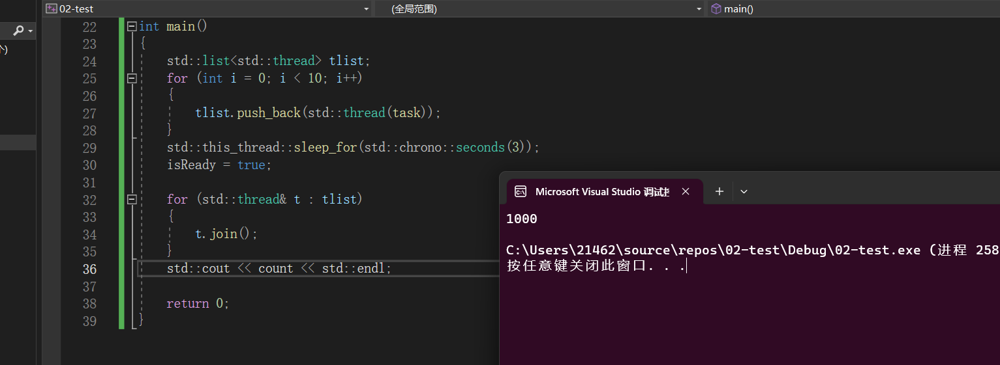

### `atomic`原子操作类型

 **互斥锁比较重，如果临界区代码比较多，应该使用互斥锁进行保证原子特性，但如果临界区代码比较简单，则需要使用到`CAS`(无锁操作)保证原子性**

 `CAS`是在硬件层面进行加锁的，当`CPU`和内存之间进行数据的交互的时候，不会允许其他线程使用总线，从而保证了线程之间的互斥。

```C++
#include <atomic>
#include <thread>
#include <list>
#include <iostream>


// 对于共享的变量，多线程都是会进行缓存的，当在主线程中修改isReady为true的时候，子线程并不会立即看到其为true，因为此时子线程读取的是自己的缓存中的isReady , 在共享变量之前加上关键字volatile 表示其不会被多线程缓存，而是直接进行读取

volatile std::atomic_bool isReady = false ;
volatile std::atomic_int count = 0 ;

void task()
{
    while (!isReady)
    {
        // 线程出让当前的时间片，等待下一次的调度。
        std::this_thread::yield();

    }
    for (int i = 0; i < 100; ++i)
    {
        count++;
    }
}

int main()
{
    std::list<std::thread> tlist;
    for (int i = 0; i < 10; i++)
    {
        tlist.push_back(std::thread(task));
    }
    std::this_thread::sleep_for(std::chrono::seconds(3));
    isReady = true;
   
    for (std::thread& t : tlist)
    {
        t.join();
    }
    std::cout << count << std::endl;

    return 0;
}
```



==执行结果为1000，说明原子性得到了保证==