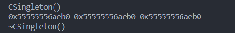

 

设计模式概念
------

设计模式简单来说就是在解决某一类问题场景时，有既定的，优秀的代码框架可以直接使用，与我们自己摸索出来的问题解决之道相比较，有以下优点可取：

1.  代码更易于维护，代码的可读性，复用性，可移植性，健壮性会更好
2.  当软件原有需求有变更或者增加新的需求时，合理的设计模式的应用，能够做到软件设计要求的“**开-闭原则**”，即对修改关闭，对扩展开放，使软件原有功能修改，新功能扩充非常灵活
3.  合理的设计模式的选择，会使软件设计更加模块化，积极的做到软件设计遵循的根本原则“**高内聚，低耦合**”

因此掌握常用的设计模式非常有必要，无论是找工作，还是对于我们自己的项目软件设计，都很有帮助。

[单例模式](https://so.csdn.net/so/search?q=%E5%8D%95%E4%BE%8B%E6%A8%A1%E5%BC%8F&spm=1001.2101.3001.7020)简介
------------------------------------------------------------------------------------------------------

单例模式指的是，无论怎么获取，**永远只能得到该类类型的唯一一个实例对象**，那么设计一个单例就必须要满足下面三个条件：

1.  ==构造函数私有化，这样用户就不能任意定义该类型的对象了==
2.  ==定义该类型唯一的对象==
3.  通过一个`static`静态成员方法返回唯一的对象实例

饿汉单例模式
------

下面代码演示一个**饿汉式**单例模式：

```C++
class CSingleton
{
public:
	static CSingleton* getInstance()
	{
		return &single;
	}
private:
	static CSingleton single;
	CSingleton() { cout << "CSingleton()" << endl; }
	~CSingleton() { cout << "~CSingleton()" << endl; }
	CSingleton(const CSingleton&); // 防止外部使用拷贝构造产生新的对象，如下面CSingleton s = *p1;
};
CSingleton CSingleton::single ; // 在程序开始的时候，分配内存，执行默认初始化

int main()
{
	CSingleton *p1 = CSingleton::getInstance();
	CSingleton *p2 = CSingleton::getInstance();
	CSingleton *p3 = CSingleton::getInstance();
	cout<<p1<<" "<<p2<<" "<<p3<<endl;
	return 0;
}
```

**打印的结果如下：**  
  
可以看到，三次获取的`CSingleton`对象都是同一个对象实例，这是一个**饿汉式**单例模式。

**饿汉式**单例模式(比较着急的那种)，顾名思义，就是==程序启动==时就实例化了该对象，**并没有推迟到第一次使用该对象时再进行实例化**；如果运行过程中没有使用到，该实例对象就被浪费掉了。

懒汉单例模式
------

下面继续演示一个**懒汉式**单例模式：

```C++
class CSingleton
{
public:
	static CSingleton* getInstance()
	{
		if (nullptr == single)
		{
			single = new CSingleton();
		}
		return single;
	}
private:
	static CSingleton *single;
	CSingleton() { cout << "CSingleton()" << endl; }
	~CSingleton() { cout << "~CSingleton()" << endl; }
	CSingleton(const CSingleton&);
};
CSingleton* CSingleton::single = nullptr;

int main()
{
	CSingleton *p1 = CSingleton::getInstance();
	CSingleton *p2 = CSingleton::getInstance();
	CSingleton *p3 = CSingleton::getInstance();
	cout << p1 << " " << p2 << " " << p3 << endl;
	return 0;
}
```

**打印的结果如下：**  
  
符合单例模式的要求，三次获取的都是同一个对象，而且程序启动时，只对single指针初始化了空值，等第一次调用`getInstance`函数时，由于single指针为`nullptr`，才进行对象的实例化，所以是一个**懒汉式**单例模式。

所以，**懒汉式**单例模式，顾名思义，**就是对象的实例化，延迟到第一次使用它的时候**。

有人会说，上面new出来的对象，没见过delete，这样不好吧，当然了，有new没有delete，不配对啊！还有人说，管它呢，当前进程结束的时候，系统反正会回收分配给它的所有资源，包括未回收的内存，但是作为C++开发者，资源的分配和回收，我们必须要考虑清楚，不能糊涂，那么下面的修改感觉如何：

```C++
int main()
{
	CSingleton *p1 = CSingleton::getInstance();
	CSingleton *p2 = CSingleton::getInstance();
	CSingleton *p3 = CSingleton::getInstance();
	cout << p1 << " " << p2 << " " << p3 << endl;
	delete p1;    // 这里delete之前new过的对象，析构对象并且释放堆上的内存
	return 0;
}
```


这种方式怎么看，怎么不舒服，首先资源的释放如果交给用户来操作，难免会忘记写delete，又或者多次delete，成释放野指针了，所以上面释放单例对象资源的方式不够好，**我们利用static静态对象在程序结束时自动析构这么一个特征，给出如下释放资源的代码**，肯定比上面的方式要好，代码如下：

```C++
class CSingleton
{
public:
	static CSingleton* getInstance()
	{
		if (nullptr == single)
		{
			single = new CSingleton();
		}
		return single;
	}
private:
	static CSingleton *single;
	CSingleton() { cout << "CSingleton()" << endl; }
	~CSingleton() { cout << "~CSingleton()" << endl; }
	CSingleton(const CSingleton&);

	// 定义一个嵌套类，在该类的析构函数中，自动释放外层类的资源
	class CRelease
	{
	public:
		~CRelease() { delete single; }
	};
	// 通过该静态对象在程序结束时自动析构的特点，来释放外层类的对象资源
	static CRelease release;
};
CSingleton* CSingleton::single = nullptr;
CSingleton::CRelease CSingleton::release;

int main()
{
	CSingleton *p1 = CSingleton::getInstance();
	CSingleton *p2 = CSingleton::getInstance();
	CSingleton *p3 = CSingleton::getInstance();
	cout << p1 << " " << p2 << " " << p3 << endl;
	return 0;
}
```

**打印如下：**  



**对象实例已经正常析构，内存释放。**

线程安全的单例模式
---------

在开发服务器程序的时候，经常会用到多线程，**多线程要考虑代码的线程安全特性**，**不能让代码在多线程环境下出现竞态条件**，否则就要进行线程互斥操作，我们来考虑一下上面两种单例模式，如果用在多线程环境当中，是否是线程安全的单例模式。

**1\. 饿汉单例模式的线程安全特性** 
饿汉单例模式中，单例对象定义成了一个`static`静态对象，它是在程序启动时，`main`函数运行之前就初始化好的，**因此不存在线程安全问题，可以放心的在多线程环境中使用。**

**2\. 懒汉单例模式的线程安全特性** 
懒汉单例模式，获取单例对象的方法如下：

```C++
static CSingleton* getInstance()
{
	if (nullptr == single)
	{
		single = new CSingleton();
	}
	return single;
}
```


很明显，这个`getInstance`是个**不可重入函数**，也就它在多线程环境中执行，会出现**竞态条件**问题，首先搞清楚这句代码，`single` = new `CSingleton()`它会做三件事情，**开辟内存，调用构造函数，给single指针赋值**，那么在多线程环境下，就有可能出现如下问题：

**1\. 线程A先调用`getInstance`函数，由于single为 `nullptr`，进入if语 
2\. new操作先开辟内存，此时A线程的CPU时间片到了，切换到B线程 
3\. B线程由于single为`nullptr`，也进入if语句了，开始new操作**

很明显，上面两个线程都进入了if语句，都试图`new`一个新的对象，不符合单例模式的设计，那该如何处理呢？对了，应该为`getInstance`函数内部加锁，在线程间进行互斥操作。此处介绍Linux系统下，`pthread`库中提供的线程互斥操作方法`mutex`互斥锁，代码如下：

```C++
#include <iostream>
#include <pthread.h>
using namespace std;

class CSingleton
{
public:
	static CSingleton* getInstance()
	{
		// 获取互斥锁
		pthread_mutex_lock(&mutex);
		if (nullptr == single)
		{
			single = new CSingleton();
		}
		// 释放互斥锁
		pthread_mutex_unlock(&mutex);
		return single;
	}
private:
	static CSingleton *single;
	CSingleton() { cout << "CSingleton()" << endl; }
	~CSingleton() 
	{ 
		pthread_mutex_destroy(&mutex); // 释放锁
		cout << "~CSingleton()" << endl; 
	}
	CSingleton(const CSingleton&);

	class CRelease
	{
	public:
		~CRelease() { delete single; }
	};
	static CRelease release;
	
	// 定义线程间的互斥锁
	static pthread_mutex_t mutex;
};
CSingleton* CSingleton::single = nullptr;
CSingleton::CRelease CSingleton::release;
// 互斥锁的初始化
pthread_mutex_t CSingleton::mutex = PTHREAD_MUTEX_INITIALIZER;

int main()
{
	CSingleton *p1 = CSingleton::getInstance();
	CSingleton *p2 = CSingleton::getInstance();
	CSingleton *p3 = CSingleton::getInstance();
	return 0;
}
```


上面的代码，是一个线程安全的懒汉单例模式，但是明眼人都能看出来，效率太低，因为每次调用`getInstance`都需要加锁解锁，除了第一次调用，后面对`getInstance`函数持续的加解锁实在时没有必要，所以这里需要使用**锁+双重判断**，也叫**双重检验锁**，把上面的`getInstance`函数代码修改如下：

```C++
static CSingleton* getInstance()
{
	if (nullptr == single)
	{
		// 获取互斥锁
		pthread_mutex_lock(&mutex);
		/* 
		这里需要再添加一个if判断，否则当两个
		线程都进入这里，又会多次new对象，不符合
		单例模式的涉及
		*/
		if(nullptr == single)
		{
			single = new CSingleton();
		}
		// 释放互斥锁
		pthread_mutex_unlock(&mutex);
	}
	
	return single;
}
```


既满足了效率，又满足线程安全，一举两得！既然是在学习C++，不如把互斥锁封装成一个类，使用起来更加`OOP`，代码如下所示：

```C++
#include <iostream>
#include <pthread.h>
using namespace std;

// 对互斥锁操作的封装
class CMutex
{
public:
	CMutex(){pthread_mutex_init(&mutex, NULL);}  // 初始化锁
	~CMutex(){pthread_mutex_destroy(&mutex);}  // 销毁锁 
	void lock(){pthread_mutex_lock(&mutex);}  // 获取锁
	void unlock(){pthread_mutex_unlock(&mutex);}  // 释放锁
private:
	pthread_mutex_t mutex;
};

class CSingleton
{
public:
	static CSingleton* getInstance()
	{
		if (nullptr == single)
		{
			// 获取互斥锁
			mutex.lock();
			/* 
			这里需要再添加一个if判断，否则当两个
			线程都进入这里，又会多次new对象，不符合
			单例模式的涉及
			*/
			if(nullptr == single)
			{
				single = new CSingleton();
			}
			// 释放互斥锁
			mutex.unlock();
		}
		
		return single;
	}
private:
	static CSingleton *single;
	CSingleton() { cout << "CSingleton()" << endl; }
	~CSingleton() { cout << "~CSingleton()" << endl;}
	CSingleton(const CSingleton&);

	class CRelease
	{
	public:
		~CRelease() { delete single; }
	};
	static CRelease release;
	
	//线程间的静态互斥锁
	static CMutex mutex;
};
CSingleton* CSingleton::single = nullptr;
CSingleton::CRelease CSingleton::release;
// 定义互斥锁静态对象
CMutex CSingleton::mutex;

int main()
{
	CSingleton *p1 = CSingleton::getInstance();
	CSingleton *p2 = CSingleton::getInstance();
	CSingleton *p3 = CSingleton::getInstance();
	return 0;
}
```


问题思考
----

请思考下面这个懒汉单例模式是否是线程安全的，代码如下：

```C++
#include <iostream>
using namespace std ; 

class CSingleton
{
public:
	static CSingleton* getInstance()
	{
		static CSingleton single; // 懒汉式单例模式，定义唯一的对象实例
		return &single;
	}
private:
	static CSingleton *single;
	CSingleton() { cout << "CSingleton()" << endl; }
	~CSingleton() { cout << "~CSingleton()" << endl;}
	CSingleton(const CSingleton&);
};
int main()
{
	CSingleton *p1 = CSingleton::getInstance();
	CSingleton *p2 = CSingleton::getInstance();
	CSingleton *p3 = CSingleton::getInstance();
	return 0;
}
```


上面的单例模式在多线程环境中使用时，会不会出现这种情况，线程A第一次调用`getInstance`函数的时候，single对象第一次初始化，此时线程B也调用`getInstance`函数，会不会也进行`single`对象的初始化呢，因为此时线程A并没有初始化完single？

在Linux环境中，通过g++编译上面的代码，命令如下： 
`g++ -o main main.cpp -g`
生成可执行文件main，用`gdb`进行调试，到`getInstance`函数，并打印该函数的汇编指令，如下： 
可以看到，**对于static静态局部变量的初始化，编译器会自动对它的初始化进行加锁和解锁控制，使静态局部变量的初始化成为线程安全的操作，不用担心多个线程都会初始化静态局部变量，因此上面的懒汉单例模式是线程安全的单例模式！**

曾经看到过一篇面经分享，说一个互联网大厂的面试，一个单例模式问了40多分钟，从面向对象思想，到软件设计思想，到设计模式，再到Linux操作系统的进程和线程模型，线程间的互斥和通信，围绕单例模式逐步考察，所以知识的学习还是要串联，在此抛砖引玉。