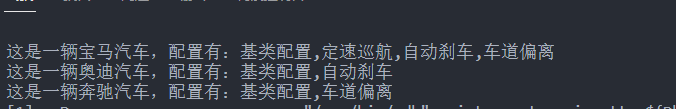

### 装饰器模式：主要是增加现有类的功能，但是增加现有类的功能还有一个方法，就是新增加一个子类，不过后者的代码是呈指数的形式增长的，这样会造成代码急剧膨胀，非常不推荐。

示例代码：

```C++
#include "pch.h"
#include <iostream>
#include <memory>
using namespace std;

/*
装饰器模式 Decorator
通过子类实现功能增强的问题：为了增强现有类的功能，通过实现子类的方式，
重写接口，是可以完成功能扩展的，但是代码中有太多的子类添加进来了
*/
class Car // 抽象基类
{
public:
	virtual void show() = 0;
};

// 三个实体的汽车类
class Bmw : public Car
{
public:
	void show() 
	{
		cout << "这是一辆宝马汽车，配置有：基类配置";
	}
};
class Audi : public Car
{
public:
	void show()
	{
		cout << "这是一辆奥迪汽车，配置有：基类配置";
	}
};
class Benz : public Car
{
public:
	void show()
	{
		cout << "这是一辆奔驰汽车，配置有：基类配置";
	}
};

// 装饰器1  定速巡航
class ConcreteDecorator01 : public Car
{
public:
	ConcreteDecorator01(Car *p) :pCar(p) {}
	void show()
	{
		pCar->show();
		cout << ",定速巡航";
	}
private:
	Car *pCar;
};
class ConcreteDecorator02 : public Car
{
public:
	ConcreteDecorator02(Car *p) :pCar(p) {}
	void show()
	{
		pCar->show();
		cout << ",自动刹车";
	}
private:
	Car *pCar;
};
class ConcreteDecorator03 : public Car
{
public:
	ConcreteDecorator03(Car *p) :pCar(p) {}
	void show()
	{
		pCar->show();
		cout << ",车道偏离";
	}
private:
	Car *pCar;
};
int main()
{
	Car *p1 = new ConcreteDecorator01(new Bmw()) ; 
   p1 = new ConcreteDecorator02(p1);
   p1 = new ConcreteDecorator03(p1) ;
	
   p1->show() ; // 多层嵌套，递归调用，实际底层调用的还是Bmw->show() 
   
	cout << endl;

	Car *p2 = new ConcreteDecorator02(new Audi());
	p2->show();
	cout << endl;

	Car *p3 = new ConcreteDecorator03(new Benz());
	p3->show();
	cout << endl;

	return 0;
}
```



