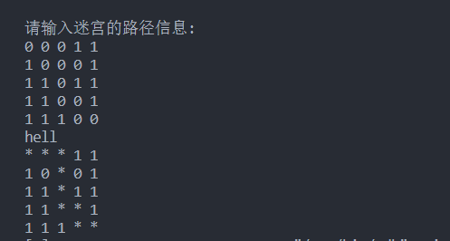

### 代码实践

```C++
/*

深度遍历搜索迷宫路径，软件运行要求如下：

请输入迷宫的行列数(例如：10 10):5 5
请输入迷宫的路径信息(0表示可以走，1表示不能走):
0 0 0 1 1
1 0 1 0 1
1 1 0 1 1
1 1 0 0 1
1 1 1 0 0
迷宫路径搜索中...
>>>如果没有路径，直接输出<<<
不存在一条迷宫路径！
>>>如果有路径，直接输出<<<
* * * 1 1
1 0 * 0 1
1 1 * 1 1
1 1 * * 1
1 1 1 * *
   
*/
 
```


实现代码：

```C++
#include <iostream>
#include <stack> 
using namespace std ; 

const int RIGHT = 0 ; 
const int DOWN = 1 ; 
const int LEFT = 2 ; 
const int UP = 3 ; 

const int WAY_NUM = 4 ; 
const int YES = 4 ; 
const int NO = 5 ; 

class Maze{
public :
	Maze(int row , int col ): _row(row ) , _col(col)
	{
		_pMaze = new Node*[_row] ; 
		for(int i = 0 ; i < _row ; ++i )
		{
			_pMaze[i] = new Node[_col] ;  
		}
		
		// 这里为什么不直接写(报错，表达式必须含有常量值)
		//_pMaze = new Node[_row][_col] ; 
	} 
	void initNode(int x , int y , int val )
	{
		_pMaze[x][y]._val = val ; 
		_pMaze[x][y]._x = x ; 
		_pMaze[x][y]._y = y ; 
		for(int i = 0 ; i < WAY_NUM ; ++i )
		{
			_pMaze[x][y]._state[i] = NO ; 
		}
	}

	void setNodeState()
	{
		for(int i = 0;  i < _row ; ++ i)
		{
			for(int j = 0 ; j < _col ; ++j )
			{
				if(_pMaze[i][j]._val == 1 ) continue ; 
				if( (j + 1 < _col)  &&  (!(_pMaze[i][j + 1 ]._val) ) ) {_pMaze[i][j]._state[RIGHT] = YES ; }  	
				if((i + 1  < _row)  && (!(_pMaze[i + 1][j]._val))  ) {_pMaze[i][j]._state[DOWN] = YES ; }
				if((j - 1 >= 0)  && (! (_pMaze[i][j - 1]._val) ) ){_pMaze[i][j]._state[LEFT] = YES; }
				if((i - 1 >= 0 ) && (!(_pMaze[i - 1][j]._val))) {_pMaze[i][j]._state[UP] = YES ; } 
			}

		}
	}
	void searchMazePath()
	{
		if(_pMaze[0][0]._val ){return ;}

		_stack.push(_pMaze[0][0] ) ; 
		while(!_stack.empty() ) 
		{
			Node top = _stack.top() ; 
			int x = top._x ; 
			int y = top._y ; 
			if(( ( x == _row - 1 )  && (y == _col - 1)  ) ) 
			{
				return  ; 
			} 

			// 这里判断条件不能写为 if(top._state[RIGHT] == YES ) ,这样写会造成死循环
			// 如果下一个方向为YES说明其一定存在，不会越界
			if(_pMaze[x][y]._state[RIGHT] == YES )
			{	
				_pMaze[x][y]._state[RIGHT] = NO ;   // 直接先对这条路径否定，防止后序的重入
				_pMaze[x][y + 1]._state[LEFT] = NO ;  // 防止死循环
				_stack.push(_pMaze[x][y + 1] ) ;
				continue ;  

			}	
			if(_pMaze[x][y]._state[DOWN] == YES )
			{	
				_pMaze[x][y]._state[DOWN] = NO ;   // 在回退到当前点的时候，防止第二次的重入
				_pMaze[x + 1][y]._state[UP] = NO ;  // 防止死循环
				_stack.push(_pMaze[x + 1][y] ) ;
				continue ;  
			}
			if(_pMaze[x][y]._state[LEFT] == YES )
			{	
				_pMaze[x][y]._state[LEFT] = NO ;   // 直接先对这条路径否定，防止后序的重入
				_pMaze[x][y - 1 ]._state[RIGHT] = NO ;  // 防止死循环
				_stack.push(_pMaze[x][y - 1 ] ) ;
				continue ;  
			}
			if (_pMaze[x][y]._state[UP] == YES )
			{
				_pMaze[x][y]._state[UP] = NO ;   // 直接先对这条路径否定，防止后序的重入
				_pMaze[x - 1 ][y]._state[DOWN] = NO ;  // 防止死循环
				_stack.push(_pMaze[x - 1][y] ) ;
				continue ;
			}
			//cout << "hell " << endl ; 
			_stack.pop() ; 
		}

	}

	void show()
	{
		if(!_stack.empty())
		{
			while(!_stack.empty())
			{
				Node top = _stack.top() ; 
				_pMaze[top._x][top._y]._val = 2 ; 
				_stack.pop() ; 
			}
			for(int i = 0 ; i < _row ; ++ i )
			{
				for(int j = 0 ; j < _col ; ++ j )
				{
					if(_pMaze[i][j]._val == 2 ){cout << "* " ; }
					else cout << _pMaze[i][j]._val << ' ' ; 
				}
				cout << endl ; 
			} 
			return ; 
		}
		cout << "不好意思，你输入的迷宫不存在可行解" << endl ; 
	}
private:
	struct Node{
		int _x ; 
		int _y ; 
		int _val ;
		int _state[WAY_NUM] ; 
	}; 
	int _row ;
	int _col ; 
	// 动态生成迷宫路径
	Node **_pMaze ; 
	stack<Node> _stack ;  // 栈结构用来存储路径
} ; 

int main()
{

	cout << "请输入迷宫的行列数:" << endl ;
	int row , col , data ; 
	cin >> row >> col ; 
	Maze maze(row , col ) ; 
	cout <<  "请输入迷宫的路径信息:" << endl ; 
	for(int i = 0 ;i < row ; i ++ )
	{
		for(int j = 0 ; j < col ; ++ j )
		{
			cin >> data ; 
			maze.initNode(i , j , data ) ; 
		}
	}
	maze.setNodeState() ; 
	//cout << "hell " << endl ; 
	maze.searchMazePath() ; 
	
	maze.show() ; 

	return 0 ; 
}
```

遇到的问题：

> 在C++中，不能直接使用 `new` 运算符创建二维数组 `new arr[row][col]` **是因为 C++ 的 `new` 运算符并不支持直接创建多维数组**。C++ 中的 `new` 运算符用于动态分配单一维度的内存块，并返回指向该内存块的指针。如果要创建多维数组，你需要使用嵌套的指针或者采用其他方法来模拟多维数组。
>
> 以下是一些原因：
>
> 1.  **语法限制：** C++ 的 `new` 运算符只能直接分配单一维度的内存块。在 `new arr[row][col]` 中，`arr` 是一个二维数组，但 `new` 运算符只能处理单一维度的情况。多维数组的每个维度都需要单独分配内存块。
>   
> 2.  **指针的嵌套：** 为了模拟多维数组，你可以使用指向指针的指针，例如 `int** arr`，其中 `arr` 是一个指向指针的指针，每个指针指向一个整数数组，这样就可以实现多维数组的效果。
>   
> 3.  **内存布局：** 多维数组通常在内存中是按行优先或列优先存储的，而 `new` 运算符无法直接提供对这种内存布局的支持。因此，你需要手动管理每个维度的内存分配，以确保正确的内存布局。
>   
>
> 要动态创建多维数组，你可以使用嵌套指针或者更高级的数据结构，如 `std::vector` 的嵌套或 `std::vector<std::vector>` 来管理二维数组，或者使用动态分配的数组，如 `int**`，并手动管理内存分配和释放。这些方法能够更好地满足多维数组的需求，并提供更好的内存管理和代码可读性。

