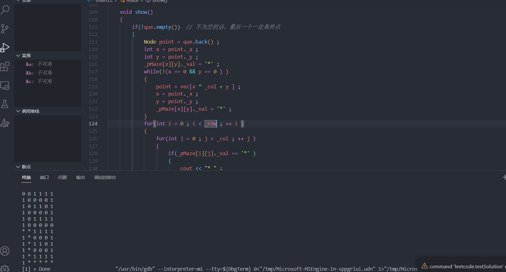

### 广度优先遍历求最短路径

```C++
寻找迷宫最短路径
在迷宫里面怎么找最短的路径？？？
广度遍历迷宫路径搜索
0 0 1 1 1 1
1 0 0 0 0 1
1 0 1 1 0 1
1 0 0 0 0 1
1 0 1 1 1 1
1 0 0 0 0 0


广度优先遍历搜索迷宫路径，软件运行要求如下：

请输入迷宫的行列数(例如：10 10):5 5
请输入迷宫的路径信息(0表示可以走，1表示不能走):
0 0 0 1 1
1 0 1 0 1
1 1 0 1 1
1 1 0 0 1
1 1 1 0 0
迷宫路径搜索中...
>>>如果没有路径，直接输出<<<
不存在一条迷宫路径！
>>>如果有路径，直接输出<<<
* * * 1 1
1 0 * 0 1
1 1 * 1 1
1 1 * * 1
1 1 1 * *
*/
```

示例代码

```C++
#include <iostream>
#include <stack> 
#include <queue>
#include <vector>
using namespace std ; 

const int RIGHT = 0 ; 
const int DOWN = 1 ; 
const int LEFT = 2 ; 
const int UP = 3 ; 

const int WAY_NUM = 4 ; 
const int YES = 4 ; 
const int NO = 5 ; 

class Maze{
public :
	Maze(int row , int col ): _row(row ) , _col(col)
	{
		_pMaze = new Node*[_row] ; 
		for(int i = 0 ; i < _row ; ++i )
		{
			_pMaze[i] = new Node[_col] ;  
		}
		
		// 这里为什么不直接写(报错，表达式必须含有常量值)
		//_pMaze = new Node[_row][_col] ; 
	} 
	void initNode(int x , int y , int val )
	{
		_pMaze[x][y]._val = val ; 
		_pMaze[x][y]._x = x ; 
		_pMaze[x][y]._y = y ; 
		for(int i = 0 ; i < WAY_NUM ; ++i )
		{
			_pMaze[x][y]._state[i] = NO ; 
		}
		// 指定现存的空间。
		vec.resize(_col * _row ) ; 
	}

	void setNodeState()
	{
		for(int i = 0;  i < _row ; ++ i)
		{
			for(int j = 0 ; j < _col ; ++j )
			{
				if(_pMaze[i][j]._val == 1 ) continue ; 
				if( (j + 1 < _col)  &&  (!(_pMaze[i][j + 1 ]._val) ) ) {_pMaze[i][j]._state[RIGHT] = YES ; }  	
				if((i + 1  < _row)  && (!(_pMaze[i + 1][j]._val))  ) {_pMaze[i][j]._state[DOWN] = YES ; }
				if((j - 1 >= 0)  && (! (_pMaze[i][j - 1]._val) ) ){_pMaze[i][j]._state[LEFT] = YES; }
				if((i - 1 >= 0 ) && (!(_pMaze[i - 1][j]._val))) {_pMaze[i][j]._state[UP] = YES ; } 
			}

		}
	}
	void searchMazePath()
	{
		if(_pMaze[0][0]._val ){return ;}

		que.push(_pMaze[0][0] ) ; 
		while(!que.empty() ) 
		{
			Node fnt = que.front() ;  
			int x = fnt._x ; 
			int y = fnt._y ; 

			// 这里判断条件不能写为 if(top._state[RIGHT] == YES ) ,这样写会造成死循环
			// 如果下一个方向为YES说明其一定存在，不会越界
			if(_pMaze[x][y]._state[RIGHT] == YES )
			{	
				_pMaze[x][y]._state[RIGHT] = NO ;   // 直接先对这条路径否定，防止后序的重入
				_pMaze[x][y + 1]._state[LEFT] = NO ;  // 防止死循环
				vec[x * _col + y + 1 ] = _pMaze[x][y] ; 
				que.push(_pMaze[x][y + 1] ) ;
				if(check(x , y + 1 ) )  return ; 

			}	
			if(_pMaze[x][y]._state[DOWN] == YES )
			{	
				_pMaze[x][y]._state[DOWN] = NO ;   // 在回退到当前点的时候，防止第二次的重入
				_pMaze[x + 1][y]._state[UP] = NO ;  // 防止死循环
				vec[(x + 1 )* _col + y ] = _pMaze[x][y] ; 
				que.push(_pMaze[x + 1][y] ) ;
				if(check(x + 1 , y  ) )  return ; 
			}
			if(_pMaze[x][y]._state[LEFT] == YES )
			{	
				_pMaze[x][y]._state[LEFT] = NO ;   // 直接先对这条路径否定，防止后序的重入
				_pMaze[x][y - 1 ]._state[RIGHT] = NO ;  // 防止死循环
				vec[x * _col + y - 1 ] = _pMaze[x][y] ; 
				que.push(_pMaze[x][y - 1] ) ;
				if(check(x , y - 1 ) )  return ; 
			}
			if (_pMaze[x][y]._state[UP] == YES )
			{
				_pMaze[x][y]._state[UP] = NO ;   // 直接先对这条路径否定，防止后序的重入
				_pMaze[x - 1 ][y]._state[DOWN] = NO ;  // 防止死循环
				vec[(x - 1 ) * _col + y ] = _pMaze[x][y] ; 				
				que.push(_pMaze[x - 1][y] ) ;
				if(check(x - 1 , y) )  return ; 
			}
			//cout << "hell " << endl ; 
			que.pop() ; 
		}

	}

	void show()
	{
		if(!que.empty())  // 不为空的话，最后一个一定是终点
		{
			Node point = que.back() ; 
			int x = point._x ; 
			int y = point._y ; 
			_pMaze[x][y]._val = '*' ;
			while(!(x == 0 && y == 0 ) ) 
			{
				point = vec[x * _col + y ] ; 
				x = point._x ; 
				y = point._y ;
				_pMaze[x][y]._val = '*' ; 
			}
			for(int i = 0 ; i < _row ; ++ i )
			{
				for(int j = 0 ; j < _col ; ++ j )
				{	
					if(_pMaze[i][j]._val == '*' ) 
					{
						cout << "* " ; 
					}
					else cout << _pMaze[i][j]._val << ' ' ; 
				}
				cout << endl ; 
			}
			return ; 
		}
		cout << "不好意思，你输入的迷宫不存在可行解" << endl ; 
	}

private:
	bool check(int x , int y )
	{
		return x == _row - 1 && y == _col - 1 ;  
	}

private:

	struct Node{
		int _x ; 
		int _y ; 
		int _val ;
		int _state[WAY_NUM] ; 
	}; 
	int _row ;
	int _col ; 
	// 动态生成迷宫路径
	Node **_pMaze ; 
	queue<Node> que ;  // 栈结构用来存储路径
	vector<Node> vec ; 
} ; 

int main()
{

	cout << "请输入迷宫的行列数:" << endl ;
	int row , col , data ; 
	cin >> row >> col ; 
	Maze maze(row , col ) ; 
	cout <<  "请输入迷宫的路径信息:" << endl ; 
	for(int i = 0 ;i < row ; i ++ )
	{
		for(int j = 0 ; j < col ; ++ j )
		{
			cin >> data ; 
			maze.initNode(i , j , data ) ; 
		}
	}
	maze.setNodeState() ; 
	maze.searchMazePath() ; 
	
	maze.show() ; 

	return 0 ; 
}
```



