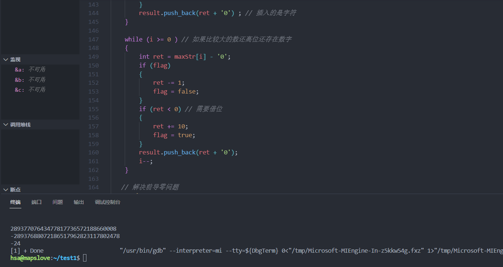

示例代码

```C++
#include <iostream>
#include <string>
#include <algorithm>
using namespace std;
// 编程题目：请实现以下类的方法，完成大数的加减法
class BigInt
{
public:
	BigInt(string str) :strDigit(str) {}
private:
	string strDigit;   // 使用字符串存储大整数

	friend ostream& operator<<(ostream &out, const BigInt &src);
	friend BigInt operator+(const BigInt &lhs, const BigInt &rhs);
	friend BigInt operator-(const BigInt &lhs, const BigInt &rhs);
};
// 打印函数
ostream& operator<<(ostream &out, const BigInt &src)
{
	out << src.strDigit;
	return out;
}
// 大数加法
BigInt operator+(const BigInt &lhs, const BigInt &rhs)
{
	/*
	遍历字符串l，r，从后往前遍历
	同位置的数字相加， 进位flag存入一个结果当中 string result
	同时完成
	某个字符串先完成都要考虑进位
	*/
	string result;
	bool flag = false;
	int i = lhs.strDigit.length() - 1;
	int j = rhs.strDigit.length() - 1;
	for (; i >= 0 && j >= 0; --i, --j) // 从低位开始相加
	{
		int ret = lhs.strDigit[i] - '0' + rhs.strDigit[j] - '0';
		if (flag) // 如果存在进位
		{
			ret += 1 ;  // 即使进位，最多进一
			flag = false ; 
		}
		if (ret >= 10 ) // 如果当前位的结果值>= 10 就修改flag的状态
		{
			ret %= 10 ;
			flag = true ;
		}
		result.push_back(ret + '0') ; // 注意这里加入的是字符。
	}
   // i 和 j 不可能同时为 0 
	if (i >= 0 )
	{
		while (i >= 0) 
		{
			int ret = lhs.strDigit[i] - '0';
			if (flag) // 如果前一位存在进位
			{
				ret += 1 ; 
				flag = false ; 
			}
			if (ret >= 10 )
			{
				ret %= 10 ;
				flag = true;
			}
			result.push_back(ret + '0');
			i-- ; 
		}
	}
	else if (j >= 0)
	{
		while (j >= 0)
		{
			int ret = rhs.strDigit[j] - '0';
			if (flag)
			{
				ret += 1;
				flag = false;
         }
			if (ret >= 10)
			{
				ret %= 10;
				flag = true;
			}
			result.push_back(ret + '0');
			j--;
		}
	}
	if (flag) // 如果最高位存在进位，则向尾端插入一个1，表示最高位。
	{
		result.push_back('1');
	}
	reverse( result.begin(), result.end() ) ;
   return result; // return BigInt(result);
}
// 大数减法
BigInt operator-(const BigInt &lhs, const BigInt &rhs)
{
	/*
	找大的字符串左减数，小的左被减数
	遍历两个字符串，减法，借位（bool flag）， string result 存下来
	*/
	string result;
	bool flag = false;
	bool minor = false ; // 结果是否为-

	string maxStr = lhs.strDigit ; // 存储两个字符串中比较大的那个 
	string minStr = rhs.strDigit ; // 存储较小的那个
	if (maxStr.length() < minStr.length())
	{
		maxStr = rhs.strDigit ; 
		minStr = lhs.strDigit ; 
		minor = true;
	}
	else if (maxStr.length() == minStr.length())
	{
		if (maxStr < minStr) // 比较两个字符串的大小，从高位开始比较
		{
			maxStr = rhs.strDigit;
			minStr = lhs.strDigit;
			minor = true;
		}
		else if (maxStr == minStr)
		{
			return string("0");
		}
	}
	int i = maxStr.length() - 1;
	int j = minStr.length() - 1;
	for (; i >= 0 && j >= 0; --i , --j )
	{
		int ret = maxStr[i] - minStr[j] ; // 等价于(maxStr[i] - '0') - (minStr[j] - '0') 
		if (flag) // 存在借位
		{
			ret -= 1 ; 
			flag = false ; 
		}
		if (ret < 0) // 需要借位
		{
			ret += 10 ;
			flag = true ;
		}
		result.push_back(ret + '0') ; // 插入的是字符
	}

	while (i >= 0 ) // 如果比较大的数还高位还存在数字
	{
		int ret = maxStr[i] - '0';
		if (flag)
		{
			ret -= 1;
			flag = false;
		}
		if (ret < 0) // 需要借位
		{
			ret += 10;
			flag = true;
		}
		result.push_back(ret + '0');
		i--;
	}

   // 解决前导零问题
	string retStr ; 
	auto it = result.rbegin();
	for (; it != result.rend(); ++it)
	{
		if (*it != '0')
		{
			break;
		}
	}
	for (; it != result.rend(); ++it)
	{
		retStr.push_back(*it) ; // 注意此时在rerStr中从左到右就是从高位到低位了
	}
	
   // 添加符号
	if (minor) // 判断是否需要添加-符号
	{
		retStr.insert(retStr.begin(), '-');
	}
	return retStr;
}
int main()
{
	BigInt int1("9785645649886874535428765");
	BigInt int2("28937697857832167849697653231243");
	BigInt int3("9785645649886874535428765");
	//28937707643477817736572188660008
	//28937707643477817736572188660008
	cout << int1 + int2 << endl;
	//28937688072186517962823117802478
	//28937688072186517962823117802478
	cout << int1 - int2 << endl;

	BigInt int4("123");
	BigInt int5("99");
	cout << int5 - int4 << endl;

	return 0;
}
```

