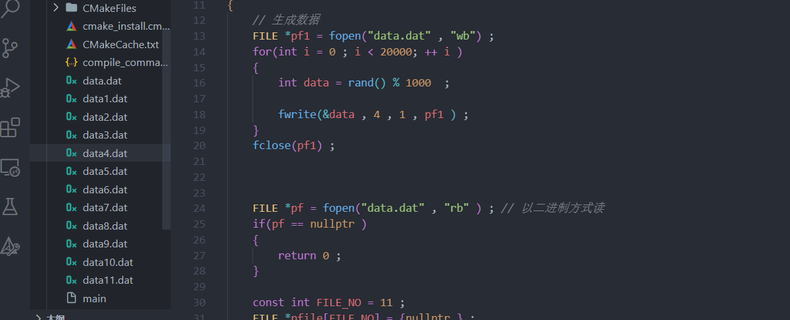

这篇文章主要讲一些校招笔试面试过程中的海量数据处理问题，主要涉及大数据的查重和求top k的问题，以及在C++中如何编写处理这些问题的代码。

查重问题
----

### 查重问题的解决方法

查重就是在一组海量数据中，查找重复的数据，这类问题大家第一反应就是使用**哈希表**，没有错，很多情况下人家考察的也就是对于哈希表的理解和应用，哈希表肯定是要熟练掌握的，还有**位图法**也是查重常用到的方法。当然在对内存限制比较严格的情况下，还会用到Bloom Filter[布隆过滤器](https://so.csdn.net/so/search?q=%E5%B8%83%E9%9A%86%E8%BF%87%E6%BB%A4%E5%99%A8&spm=1001.2101.3001.7020)，这个放在最后面描述。

1.  哈希表

`C++STL`中的**无序容器底层就是通过哈希表实现的**，其中主要涉及四个容器：


在实际解决问题的过程中，如果需要使用哈希表，可以直接使用上面的无序容器，**哈希表的增删查的时间复杂度趋近于O(1)**，效率非常高。

2.  位图法

位图法，就是用一个比特位（0或者1）来存储数据的状态，==比较适合状态简单，数据量比较大，要求内存使用率低的问题场景。==

位图法解决问题，首先需要知道待处理数据中的最大值，然后按照`size = （maxNumber / 8）(byte)+1`的大小来开辟一个`char`类型的数组，当需要在位图中查找某个元素是否存在的时候，首先需要计算该数字对应的数组中的比特位，然后读取值，0表示不存在，1表示已存在。在下面的问题中看具体应用。

**位图法有一个很大的缺点，就是数据没有多少，但是最大值却很大，比如有10个整数，最大值是10亿，那么就得按10亿这个数字计算开辟位图数组的大小，太浪费内存空间**。

### 查重问题解决示例

**实际的问题解决中，有可能对于查重算法的时间复杂度和内存使用量都有要求，需要根据实际情况具体分析，下面看一些应用示例**：

问题：有一组10亿个整数，整数取值范围也是`0到10亿`，找出第一个重复的数字？  
分析：1亿大约是`100M`字节的数量级，那么`10亿`就是`1G`字节的数量级，**`10`亿个整数大约要占用`4G`大小的内存**，如果对内存有限制，就需要用到==分治法的思想分段求解==；如果没有内存限制要求，大可以用哈希表或者位图法来解决这样的问题。

**解决方法一：哈希表** 
链式哈希表，解决哈希冲突是用链表把产生哈希冲突的数据连接起来，因此每一个节点除了保存整数数据，还需要保存指针域，因此10亿个整数，每个整数在多一个指针大小空间，**那么整个链式哈希表算下来，大约需要`4G`（数据总数）+`4G`（指针总数）= `8G`的内存空间，所以实际问题解决中，如果你回答用哈希表解决这个查重问题，接下来人家可能让你考虑内存占用量太大的问题了**。

先看看用哈希表解决这个问题的代码，示例如下：

```C++
int main()
{
	/* 
	假设这个vector中，放了原始的待查重的数据
	为了让程序更快的运行出结果，此处缩小了数据量
	*/
	vector<int> vec;
	for (int i = 0; i < 100000; ++i)
	{
		vec.push_back(rand());
	}

	// 用哈希表解决查重，因为只查重，不统计重复次数，所以用无序集合解决该问题
	unordered_set<int> hashSet;
	for (int val : vec)
	{
		// 在哈希表中查找val
		auto it = hashSet.find(val);
		if (it != hashSet.end())
		{
			cout << *it << "是第一个重复的数据" << endl;
			break; // 如果要找所有重复的数字，这里就不用break了
		}
		else
		{
			// 没找到
			hashSet.insert(val);
		}
	}

	return 0;
}
```

**解决方法二：位图法** 
上面的题目已经告诉了数据的取值范围，最大是`10亿`，如果问题没有告知数据最大值，用位图法处理问题，需要先遍历一遍数组找出最大值。**用位图法解决这个问题，内存的使用量是`4G/8` = `500M`，比上面使用哈希表所占用的内存大大减少**。如下代码示例：

```C++
#include <iostream>
#include <vector>
#include <unordered_set>
using namespace std;
int main()
{
	/* 
	假设这个vector中，放了原始的待查重的数据
	为了让程序更快的运行出结果，此处缩小了数据量
	*/
	vector<int> vec;
	for (int i = 0; i < 100000; ++i)
	{
		vec.push_back(rand());
	}

	// 用位图法解决问题
	typedef unsigned int uint;
	uint maxNumber = 1000000000;
	int size = maxNumber / 8 + 1;
	char *p = new char[size]() ; // 开辟字符数组。

	for (uint i = 0; i < vec.size(); ++i)
	{
		// 计算整数应该放置的数组下标
		int index = vec[i] / 8 ;  // index一定不会越界  
		// 计算对应字节的比特位
		int offset = vec[i] % 8 ;  // 0 ， 1 ， 2 ， 3 ， 4 ， 5 ，6 ， 7 
		// 获取相应比特位的数值
      
      // 在本例中，相当于char[i] 中每一个相当于存储了8种状态
		int v = p[index] & (1 << offset) ; // 获取这个数对应的状态
		if (v)
		{
			cout << vec[i] << "是第一个重复的数据" << endl;
			break; // 如果要找所有重复的数字，这里就不用break了
		}
		else
		{
			// 表示该数据不存在，把相应位置置1，表示记录该数据
			p[index] = p[index] | (1 << offset);
		}
	}
	delete[]p ; 
	return 0;
}
```


看完位图法，再理解这句话，**位图法很大的缺点，就是数据没有多少，但是最大值却很大，比如有10个整数，最大值是10亿，那么就得按10亿这个数字计算开辟位图数组的大小，太浪费内存空间**。

上面的问题再扩充一下，不管是找第一个重复的数字，还是找所有重复的数字，或者是找第k个重复的数字，都是在上面的代码中做相应的修改就可以了。面试中如果碰见类似在限制内存的情况下做集合的快速查找，还有布隆过滤器可以使用，这个放在最后说明。

如果在查找的过程中，**还要求统计重复的次数**，**可以使用无序映射表**，因为它可以存\[key,value\]键值对，key存放数字，value存放数字重复的次数，代码如下：

```C++
#include <iostream>
#include <unordered_map>
using namespace std;
int main()
{
	/* 
	假设这个vector中，放了原始的待查重的数据
	为了让程序更快的运行出结果，此处缩小了数据量
	*/
	vector<int> vec;
	for (int i = 0; i < 100000; ++i)
	{
		vec.push_back(rand());
	}

	// 用无序映射表，不仅统计数字，还统计数字出现的次数
	unordered_map<int, int> hashMap;
	for (int val : vec)
	{
		hashMap[val]++; // 可以直接记录数据并且更新数据出现的次数
	}

	// 打印统计出来的重复的数据
	for (pair<int, int> value : hashMap)
	{
		if (value.second > 1)
		{
			cout << "key:" << value.first << " 重复次数:" << value.second << endl;
		}
	}
	cout << endl;
	return 0;
}
```


求top k问题
--------

**top k问题大致分为两类**： 

+ 在一组数据中，找出值最大的前k个，或者找出值最小的前k个 
+ 在一组数据中，找出第k大的数字，或者找出第k小的数字。

### 小根堆和大根堆

==找前top k大的数据用小根堆，找前top k小的数据用大根堆==，那么此类问题用堆结构可以很好的解决。在一组数据中以求最大的前10个数据为例，思路就是：**先创建一个小根堆结构，然后读取10个值到堆中，然后遍历剩下的元素依次和堆顶元素进行比较，如果比堆顶元素大，那么删除堆顶元素，把当前元素添加到小根堆中，元素遍历完成，堆中剩下的10个元素，就是值最大的10个元素**。

在`C++STL`中，容器适配器`priority_queue`默认就是一个大根堆，可以通过改变模板类型，得到一个小根堆，经常会使用到。示例代码如下：

```C++
#include <iostream>
#include <queue>
#include <vector>
#include <functional>
using namespace std;
int main()
{
	/* 
	求vector容器中元素值最大的前10个数字
	*/
	vector<int> vec;
	for (int i = 0; i < 100000; ++i)
	{
		vec.push_back(rand() + i);
	}

	// 定义小根堆
	priority_queue<int, vector<int>, greater<int>> minHeap;
	// 先往小根堆放入10个元素
	int k = 0;
	for (; k < 10; ++k)
	{
		minHeap.push(vec[k]);
	}

	/*
	遍历剩下的元素依次和堆顶元素进行比较，如果比堆顶元素大，
	那么删除堆顶元素，把当前元素添加到小根堆中，元素遍历完成，
	堆中剩下的10个元素，就是值最大的10个元素
	*/
	for (; k < vec.size(); ++k)
	{
		if (vec[k] > minHeap.top())
		{
			minHeap.pop();
			minHeap.push(vec[k]);
		}
	}
	
	// 打印结果
	while (!minHeap.empty())
	{
		cout << minHeap.top() << " ";
		minHeap.pop();
	}
	cout << endl;

	return 0;
}
```


那么求前top k小的数据和上面的原理一样，**不同的就是使用一个大根堆，并且元素和堆顶元素比较的时候，要判断小于再更换**（因为要找小的元素，所以要淘汰大值元素）。

**如果找的是第k大的元素或者是第k小的元素，处理方式和上面的代码一样，只不过最后只读取堆顶元素就可以，因为这样的问题只找满足条件的一个元素而已**。


### 快排分割函数

快排的分割函数，会选择一个基数，把小于基数的数字都调整到左边，**把大于基数的数字都调整到右边，最后基数所在的位置就是第m小的数字**，如果我们找的是第k小的数字，那么情况如下： 
1.当k == m时，说明我们要找的第k小的数字已经找到了 
2.当k > m时，我们需要把基数右边的数字序列再递归进行上面的操作，直到第1步条件成立 
3.当k < m时，我们需要把基数左边的数字序列再递归进行上面的操作，直到第1步条件成立

所以**当求解第k大的数字，或者第k小的数字时，还可以用快排分割函数递归求解**，代码示例如下：

```C++
#include <iostream>
#include <vector>
using namespace std;

/*
快排分割函数，选择arr[i]号元素作为基数，把小于arr[i]的元素
调整到左边，把大于arr[i]的元素调整到右边并返回基数位置的下标
*/
int partation(vector<int> &arr, int i, int j)
{
	int k = arr[i];
	while (i < j)
	{
      // 相当于一个可替换的位置在 i , j 两侧来回跳跃
		while (i < j && arr[j] >= k)
			j--;
		if (i < j )  // 找到右边第一个不满足条件的下标
			arr[i++] = arr[j] ; // 第一次一定覆盖的是arr[i] 并且其值已经被选为k了

		while (i < j && arr[i] < k ) //找到左边第一个 arr[i] >= k 的下标
			i++ ; 
		if (i < j)
			arr[j--] = arr[i];
	}
	// 最终 i == j , 这个位置就是k应该在的位置，并且其左侧的数 < k，右侧的数 >= k

	arr[i] = k ; 
	return i;
}
/*
params:
1.vector<int> &arr: 存储元素的容器
2.int i:数据范围的起始下标
3.int j:数据范围的末尾下标
4.int k:第k个元素
功能描述：通过快排分割函数递归求解第k小的数字，并返回它的值
*/
int selectNoK(vector<int> &arr, int i, int j, int k)
{
	int pos = partation(arr, i, j);
	if (pos == k-1)
		return arr[pos];
	else if (pos < k-1)
		return selectNoK(arr, pos + 1, j, k);
	else
		return selectNoK(arr, i, pos-1, k);
}
int main()
{
	/*
	求vector容器中元素第10小的元素值
	*/
	vector<int> vec;
	for (int i = 0; i < 100000; ++i)
	{
		vec.push_back(rand() + i);
	}

	
	// selectNoK返回的就是第10小的元素的值
	cout << selectNoK(vec, 0, vec.size()-1, 10 ) << endl;
	return 0;
}
```

代码演示的是求第k小的数字，求第k大的数字代码如下：

```C++
#include <iostream>
#include <vector>
using namespace std;

// 维护的是 k 左边的>= k ，k右边的<= k 
int partation(vector<int> &arr, int i, int j)
{
	int k = arr[i];
	while (i < j)
	{
      // 相当于一个可替换的位置在 i , j 两侧来回跳跃
		while (i < j && arr[j] < k )
			j-- ; 
		if (i < j )  // 找到右边第一个不满足条件的下标
			arr[i++] = arr[j] ; // 第一次一定覆盖的是arr[i] 并且其值已经被选为k了

		while (i < j && arr[i] >= k ) //找到左边第一个 arr[i] < k 的下标
			i++ ; 
		if (i < j)
			arr[j--] = arr[i];
	}
	// 最终 i == j , 这个位置就是k应该在的位置，并且其左侧的数 >= k，右侧的数 < k

	arr[i] = k ; 
	return i;
}
/*
params:
1.vector<int> &arr: 存储元素的容器
2.int i:数据范围的起始下标
3.int j:数据范围的末尾下标
4.int k:第k个元素
功能描述：通过快排分割函数递归求解第k大的数字，并返回它的值
*/
int selectNoK(vector<int> &arr, int i, int j, int k)
{
	int pos = partation(arr, i, j);
	if (pos == k-1)
		return arr[pos];
	else if (pos < k-1)
		return selectNoK(arr, pos + 1, j, k);
	else
		return selectNoK(arr, i, pos-1, k);
}
int main()
{
	/*
	求vector容器中元素第10小的元素值
	*/
	vector<int> vec;
	for (int i = 0; i < 100000; ++i)
	{
		vec.push_back(rand() + i);
	}

	
	// selectNoK返回的就是第10小的元素的值
	cout << selectNoK(vec, 0, vec.size()-1, 10 ) << endl;
	return 0;
}
```


查重和top k问题的综合应用
---------------

如果问题是在一组数字中 ，找出重复次数最多的前10个，那么该问题就是**先进行哈希统计（查重操作），然后根据哈希统计结果再求top k问题**，如下代码示例，**演示了在一组数据中，快速找出数字重复次数最大的前10个**，代码如下：

```C++
#include <iostream>
#include <vector>
#include <queue>
#include <unordered_map>
#include <functional>
using namespace std;
// 在一组数字中 ，找出重复次数最多的前10个
int main()
{
	// 用vec存储要处理的数字
	vector<int> vec;
	for (int i = 0; i < 200000; ++i)
	{
		vec.push_back(rand());
	}

	// 统计所有数字的重复次数,key:数字的值,value:数字重复的次数
	unordered_map<int, int> numMap;
	for (int val : vec)
	{
		/* 拿val数字在map中查找，如果val不存在，numMap[val]会插入一个[val, 0]
		这么一个返回值，然后++，得到一个[val, 1]这么一组新数据
		如果val存在，numMap[val]刚好返回的是val数字对应的second重复的次数，直接++*/
		numMap[val]++;
	}

	// 先定义一个小根堆
	using P = pair<int, int>;
	using FUNC = function<bool(P&, P&)> ; 
	using MinHeap = priority_queue<P, vector<P>, FUNC>;
	
   // 相当于.second越小的元素优先级越高，也是一个小根堆
   MinHeap minheap([](auto &a, auto &b)->bool {
		return a.second > b.second; // 自定义小根堆元素的大小比较方式
	});

	// 先往堆放k个数据 
	int k = 0 ; 
	auto it = numMap.begin();

	// 先从map表中读10个数据到小根堆中，建立top 10的小根堆，最小的元素在堆顶
	for (; it != numMap.end() && k < 10; ++it, ++k)
	{
		minheap.push(*it) ; // *it的结果类型是pair<int,int>
	}

	// 把K+1到末尾的元素进行遍历，和堆顶元素比较
	for (; it != numMap.end(); ++it)
	{
		// 如果map表中当前元素重复次数大于，堆顶元素的重复次数，则替换
		if (it->second  > minheap.top().second )
		{
			minheap.pop();
			minheap.push(*it);
		}
	}
	// 堆中剩下的就是重复次数最大的前k个
	while (!minheap.empty())
	{
		auto &pair = minheap.top() ;  
		cout << pair.first << " : " << pair.second << endl;
		minheap.pop();
	}
	return 0;
}
```

**代码输出结果**： 


如果问题中对内存的使用大小做了限制，比如说有20亿个整数，内存限制`400M`，请求解重复次数最高的前10个数字，那么分析一下，20亿个整数，大约是`8G`大小，肯定无法一次性加载到内存当中，那么此时可以利用==分治法的思想==，把文件中20亿个整数通过哈希映射划分到50个小文件当中，那么每个文件大约4千万个整数，大小约是`150M`，此时小文件的数字完全可以一次行加载到内存中，然后分段求解合并最终的结果，得到重复次数最高的前10个数字，代码演示如下：

通过下面的代码，先生成放整数的二进制文件：

```C++
/*为了快速查看结果，这里缩小了数据量*/
FILE *pf1 = fopen("data.dat", "wb");
for (int i = 0; i < 20000; ++i)
{
	int data = rand();
	if (data < 0)
		cout << data << endl;
	fwrite(&data, 4, 1, pf1) ; // 将data地址中的1个大小为4的数据写入到文件指针pf1中
}
fclose(pf1);
```


下面是最终的，**在内存有所限制的情况下，通过哈希映射+哈希统计+小根堆计算出来的top 10大的整数**，代码如下：

```C++
#include <iostream>
#include <vector>
#include <queue>
#include <unordered_map>
#include <functional>
using namespace std;
// 大文件划分小文件（哈希映射）+ 哈希统计 + 小根堆(快排也可以达到同样的时间复杂度)
int main()
{
	// 打开存储数据的原始文件
	FILE *pf = fopen("data.dat", "rb");
	if (pf == nullptr)
		return 0;

	// 这里由于原始数据量缩小，所以这里文件划分的个数也变小了，11个小文件
	const int FILE_NO = 11;
	FILE *pfile[FILE_NO] = { nullptr };
	for (int i = 0; i < FILE_NO; ++i)
	{
		char filename[20];
		sprintf(filename, "data%d.dat", i + 1);
		pfile[i] = fopen(filename, "wb+");
	}

	// 哈希映射，把大文件中的数据，映射到各个小文件当中
	int data;
	while (fread(&data, 4, 1, pf) > 0)
	{
		int findex = data % FILE_NO;
		fwrite(&data, 4, 1, pfile[findex]);
	}

	// 定义一个链式哈希表
	unordered_map<int, int> numMap;
	// 先定义一个小根堆
	using P = pair<int, int>;
	using FUNC = function<bool(P&, P&)>;
	using MinHeap = priority_queue<P, vector<P>, FUNC>;
	MinHeap minheap([](auto &a, auto &b)->bool {
		return a.second > b.second; // 自定义小根堆元素大小比较方式
	});

	// 分段求解小文件的top 10大的数字，并求出最终结果
	for (int i = 0; i < FILE_NO; ++i)
	{
		// 恢复小文件的文件指针到起始位置
		fseek(pfile[i], 0, SEEK_SET);

		while (fread(&data, 4, 1, pfile[i]) > 0)
		{
			numMap[data]++;
		}

		int k = 0;
		auto it = numMap.begin();

		// 如果堆是空的，先往堆方10个数据
		if (minheap.empty())
		{
			// 先从map表中读10个数据到小根堆中，建立top 10的小根堆，最小的元素在堆顶
			for (; it != numMap.end() && k < 10; ++it, ++k)
			{
				minheap.push(*it);
			}
		}

		// 把K+1到末尾的元素进行遍历，和堆顶元素比较
		for (; it != numMap.end(); ++it)
		{
			// 如果map表中当前元素重复次数大于，堆顶元素的重复次数，则替换
			if (it->second > minheap.top().second)
			{
				minheap.pop();
				minheap.push(*it);
			}
		}

		// 清空哈希表，进行下一个小文件的数据统计
		numMap.clear();
	}

	// 堆中剩下的就是重复次数最大的前k个
	while (!minheap.empty())
	{
		auto &pair = minheap.top();
		cout << pair.first << " : " << pair.second << endl;
		minheap.pop();
	}

	return 0;
}
```

大文件到小文件的划分如下：  


**执行结果：**


一道面试问题
------

有一道大数据处理的相关面试题是这样的，**有a，b两个文件，各存放了20亿个`IP地址`，每个`IP地址`占用4字节，内存限制`1G`，如何找出a，b两个文件中相同的`IP地址`并进行输出**。

注意这个问题又是对内存进行了限制，每个文件20亿个整数，大约是`8G`，如果用链式哈希表解决，每个数据域加上指针域就是`16G`的内存空间，内存限制`1G`，一次无法将全部数据加载到内存当中。有什么解决办法呢？

1.**用哈希表解决**，当然可以，但是哈希表的特点就是比较占空间，因为要存储所有的`IP地址`，链式哈希表要考虑指针域的开销，线性探测哈希表要考虑装载因子的话，哈希表本身占用的内存空间也比较大，那怎么处理上面的问题呢？

**可以把a，b两个大文件分别划分成个数相等的小文件，比如a，b两个大文件都划分成100个小文件，那么两个文件中相同的`IP地址`，根据统一的哈希映射(`IP地址`% 100)，都会放在同一个序号的小文件当中，然后a和b对应的小文件足够小，完全可以放在内存中通过哈希表进行相同`IP地址`查找，把所有对应的小文件找完，最后的结果就出来了。**

2.**通过布隆过滤器解决**，具体内容看下面的介绍。

Bloom Filter布隆过滤器
-----------------

校招面试过程中，搜索查找问题经常会考察到，除了考察二分查找，哈希表，高级数据结构算法还有`BST`，`AVL`，红黑树，跳跃表，前缀树（字典树），倒排索引等等，都是在各种场景下做快速查找搜索用的，这些内容在我的博客上都会持续进行更新，请留意内容。

**在内存有所限制的情况下（如上面的面试问题），快速判断一个元素是否在一个集合（容器）当中，还可以使用布隆过滤器**。

布隆过滤器到底是个什么东西呢？通俗来讲，**在使用哈希表比较占内存的情况下，它是一种更高级的“位图法”解决方案**，==之所以说它更高级，是因为它没有上面位图法所说的缺陷==，网上各种博客对Bloom Filter已经描述过很多了，这里就不再啰嗦一遍了，参考这篇不错的讲解布隆过滤器（上面还有**十道海量数据处理面试题与十个方法大总结**）的博客文章链接：[https://blog.csdn.net/v\_july\_v/article/details/6685894](https://blog.csdn.net/v_july_v/article/details/6685894)【==注：这篇文章一定要认真的再看一遍==】

**这里总结一下Bloom Filter的注意事项**： 
1.`Bloom Filter`是通过一个**位数组+k个哈希函数**构成的。 
2.`Bloom Filter`的空间和时间利用率都很高，但是它有一定的错误率，虽然错误率很低，Bloom Filter判断某个元素不在一个集合中，**那该元素肯定不在集合里面**；Bloom Filter判断某个元素在一个集合中，**那该元素有可能在，有可能不在集合当中**。 
3.`Bloom Filter`的查找错误率，**当然和位数组的大小**，以及**哈希函数的个数有关系**，具体的错误率计算有相应的公式（错误率公式的掌握看个人理解，不做要求）。 
4.`Bloom Filter`默认只支持add增加和query查询操作，不支持delete删除操作（因为存储的状态位有可能也是其它数据的状态位，删除后导致其它元素查找判断出错）。

**Bloom Filter增加元素的过程就是**：把元素的值通过k个哈希函数进行计算，得到k个值，然后把k当作位数组的下标，在位数组中把相应k个值修改成1。

**Bloom Filter查询元素的过程就是**：把元素的值通过k个哈希函数进行计算，得到k个值，然后把k当作位数组的下标，看看相应位数组下标标识的值是否全部是1，如果有一个为0，表示元素不存在（判断不存在绝对正确）；如果都为1，表示元素存在（判断存在有错误率）。

所以用Bloom Filter解决上面的面试问题就很简单，它需要少量的内存就可以判断元素是否存在集合当中，用a文件的数据构建Bloom Filter的位数组中的状态值，然后再读取b文件的数据进行布隆过滤的查找操作就可以了。